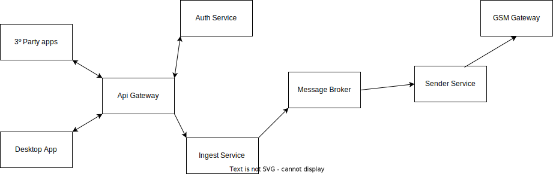

# SMS Sender

An example application to apply microservices concepts that sends mass sms messages

## Premises

- The problem is a sms sender application: the corp has clients that need to send a lot of sms messages to their customers. They need a web interface to upload files with phone numbers and respective messages. Also they need to see a summarized visualization of the sending progress.
- Two types of users, the sender, that sends messages (duh) and the admin that sees info about the operation and manages the clients (senders)
- Two type of messages: template messages and already built messages
  - Template message: the user defines a template message and the bulk info of each recipient is applied to that template and that makes the final message to be sent
  - Already build message: the prebuilt message comes with the recipient's phone and we don't need to do any processing of them (in principle)

## Objectives

- Use microservices architechure
- Implement all aspects of an applcation for sending mass sms messages:
  - Ingestion (Clients send the numbers and the messages to send)
  - Authentication
  - SMS Sending service (The one that takes the complete message and phone number and sends them)
  - User Dashboard
  - Rest api to integrate with 3º party applications
- Use Rust lang whenever possible

## General architecture

- Ingestion service
  - Processes the files and build the messages to be sent
- <strike>Web interface</strike> Desktop app (to use rust to implement that)
- Sender service (may be multiple)
- Rabbitmq as broker
- Public API (that also the <strike>web</strike> desktop interface uses)
- Auth service to handle users and permissions

## Each service specifics

See each sub folder for info about them
